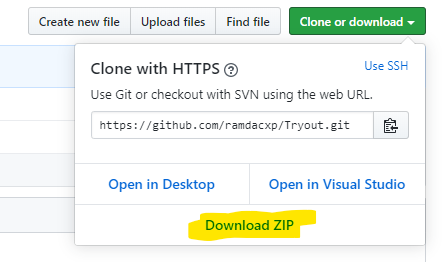
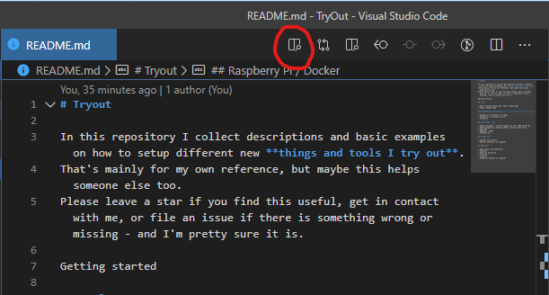

# Getting Started

This repository contains descriptions and basic examples for different topics I tried out.
First of all, you can read all this online on GitHub at <https://github.com/ramdacxp/Tryout> and you're done.But most likely you would like to download the samples and try those out on your own machine. *So read on...*

I run all this on Windows 10 desktop PCs. My main setup includes git for version control, Node.JS for the web stack, the DotNet SDK for real programming, and Visual Studio Code as my one-for-all editor.
The [basic tooling setup](tools/BasicToolingSetup.md) is described [here](tools/BasicToolingSetup.md).

## Download this repo

You can download this repository as ZIP archive via the green [Clone or download] button [from this GitHub page](https://github.com/ramdacxp/Tryout).



The more convenient and recommended way is to clone the repository via git.

The Visual Studio default location for local git repositories is `Source\Repos` within the user's profile directory. So the following command line statements clone the repository into this location and open it as workspace in Visual Studio Code.

```cmd
mkdir %userprofile%\Source\Repos
cd /d %userprofile%\Source\Repos
git clone https://github.com/ramdacxp/Tryout.git
code Tryout
```

I configured some *recommended Visual Studio Code extensions* for the workspace which simplify the handling with markdown files. You will be prompted to view or install those. Feel free to do so.

In VSCode open `README.md`and click the first button in the top-right corner to open a HTML preview locally.



## Try some samples

I found it more useful to describe everything in a *single* Tryout git repository. This allows to search through a single place.

To keep things organized, all samples and tools are described in *separate sub folders*. If required, those folders are configured as VSCode workspaces. When **opened as folder**, tooling shortcuts, tasks, and extensions are setup automatically. This makes life much easier.

Use the terminal integrated into VSCode (press `Strg-Ö` if using a german keyboard layout) and simply type `code SubFolderName` to open the related folder in a new VSCode window.

Each sub topic has its own description which is linked from the main [README.md](README.md) file.

Have fun!