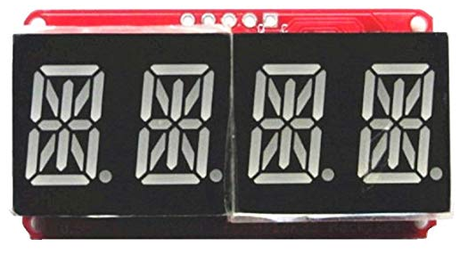

# 14 Segment LED Modul via I2C / HT16K33

## Hardware Info



Ordered on 22.12.2019 at Amazon:

* Homyl 5 STK. 0,56 '' Digital Rohr LED-Anzeige Modul I2C Steuerung 14 Segment 2 Zeilen Steuerung für Arduino
* Price for 5 modules: 11,30 EUR
* Free china shipping (took 3 weeks)

Direct wiring between D1 Mini I2C pins and the 14-Segment backpack is possible.

| Pin 14-Segment | Description    | Pin Wemo D1 Mini |
|----------------|----------------|------------------|
| +3,3V          | VCC Data logic | 3V3              |
| +5V            | VCC LED        | 5V               |
| -              | Ground         | G                |
| D              | I2C Data       | D2 (GPIO4 + SDA) |
| C              | I2C Clock      | D1 (GPIO5 + SCL) |

## Changing the I2C Address

If you want to have more than one device on the same I2C bus, each one needs to have a unique 'address'.

You can set the address by jumpering the A0, A1, and A2 solder jumpers.  By default, no jumpers are soldered, giving an address of 0x70 (offset 0). If you want to have an address of 0x73 (0x70 + offset 3) you would solder A0 (bit 0) and A1 (bit 1) for an address offset of "011" = 3 in binary.

## LED Layout


If programmed with "raw" 16-bit values, each LED can be controlled individually by using the following mapping:

| Bit   | 16 | 15 | 14 | 13 | 12 | 11 | 10 | 9 | 8  | 7  | 6 | 5 | 4 | 3 | 2 | 1 |
|-------|----|----|----|----|----|----|----|---|----|----|---|---|---|---|---|---|
| Value | -  | DP | N  | M  | L  | K  | J  | H | G2 | G1 | F | E | D | C | B | A |

The first bit #16 isn't used, keep it 0.  
**Examples:** To turn on just segment A, use 0x0001; to turn on segment G1, use 0x0040.

## Code

```cpp
#include <Arduino.h>

// SPI header is needed on top of the Adafruit headers if using PlatformIO.
// See: https://community.platformio.org/t/spi-h-for-adafruit-16x8-led-matrix/11699
#include <SPI.h>

#include <Wire.h>
#include <Adafruit_GFX.h>
#include "Adafruit_LEDBackpack.h"

Adafruit_AlphaNum4 alpha4 = Adafruit_AlphaNum4();
alpha4.begin(0x70);
alpha4.writeDigitRaw(0, 0x0);     // all off
alpha4.writeDigitRaw(1, 0x3FFF);  // all on
alpha4.writeDigitAscii(2, 'A');
alpha4.writeDigitAscii(3, 'Z');
alpha4.writeDisplay();

alpha4.blinkRate(0);      // 0...3 permanent, fast/medium/slow blinking
alpha4.setBrightness(0);  // 0..15 dark ... bright
```

## Libraries and Platform IO settings

Required libraries can be found via [Platform IO Library Search](https://platformio.org/lib/search):

* <https://platformio.org/lib/show/25/Adafruit%20LED%20Backpack%20Library>
* <https://platformio.org/lib/show/13/Adafruit%20GFX%20Library>

```ìni
[env:d1_mini]
platform = espressif8266
board = d1_mini
framework = arduino

lib_deps =
  Adafruit LED Backpack Library
  Adafruit GFX Library
```
