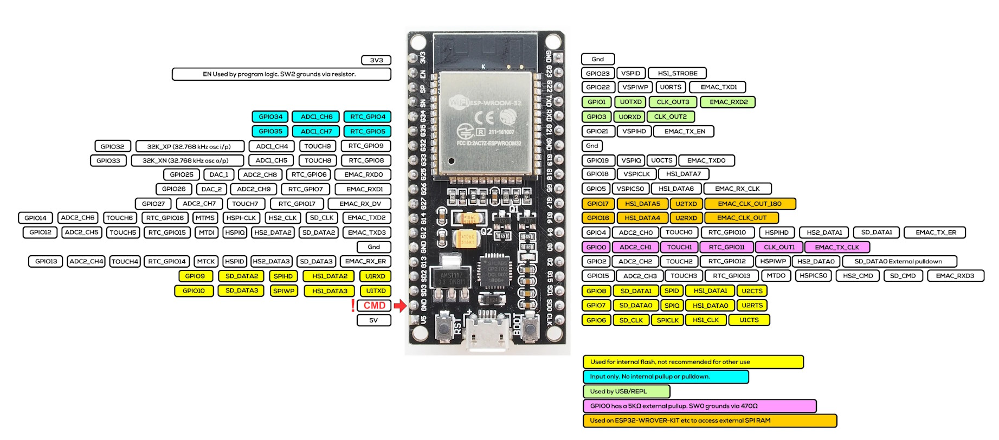

# HUB75 Matrix Display

## Az-Delivery ESP32 WROOM-32

## Hub75

Non-DMA:

* https://github.com/2dom/PxMatrix

* https://github.com/rasafitri/matrix-example

DMA:

* https://github.com/mrcodetastic/ESP32-HUB75-MatrixPanel-DMA
  * PINS: https://github.com/mrcodetastic/ESP32-HUB75-MatrixPanel-DMA/blob/master/src/platforms/esp32/esp32-default-pins.hpp

# CP2102 Win 11 Treiber

https://www.silabs.com/developer-tools/usb-to-uart-bridge-vcp-drivers?tab=downloads

* Download "CP210x Universal Windows Driver", v11.4.0, 12/18/2024
* Right click on the `silabser.inf` file and select "Install"
