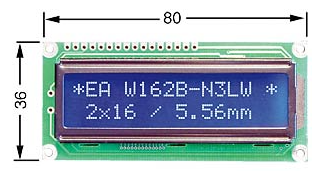

# LCD Display 162C BL (I2C)

## Hardware Info

* [LCD 162C BL LCD-Modul](https://www.reichelt.de/lcd-modul-2x16-h-5-6mm-bl-ws-m-bel--lcd-162c-bl-p53941.html) (Reichelt, 11 EUR)
* [AZDelivery 5 x I2C IIC Adapter serielle Schnittstelle für LCD Display 1602 und 2004 mit gratis eBook!](https://amazon.de/gp/product/B078SXLJ7Q) (Amazon, 5x for 6,79 EUR)

## Pin Layout

LCD display is connected via its 16 pins to the serial adapter.  
Connection of serial adapter to WeMos D1 Mini:

| Pin adapter | Pin D1-Mini |
|-------------|-------------|
| GND         | G           |
| VCC         | 5V          |
| SDA         | D2          |
| SCL         | D1          |

## Links

* <https://makesmart.net/lcd-display-hd44780-i2c-esp8266-d1-mini-tutorial/>
