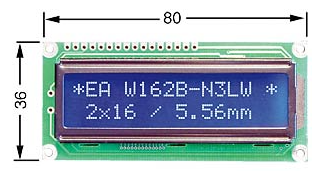
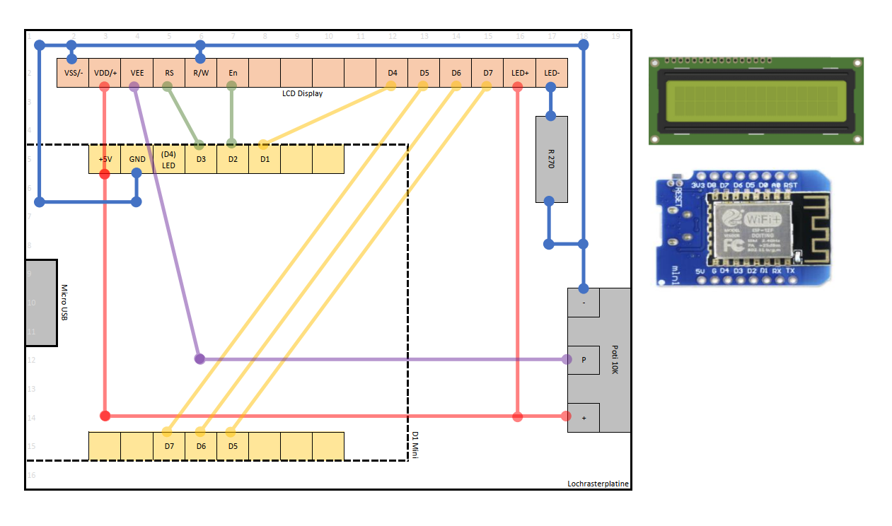

# LCD Display 162C BL (non I2C)

## Hardware Info



Ordered on 3/2015 at Reichelt

* [LCD 162C BL LCD-Modul, 2x16, H:5,6mm, bl/ws, m.Bel.](http://www.reichelt.de/LCD-162C-BL/3/index.html?&ACTION=3&LA=446&ARTICLE=53941&artnr=LCD+162C+BL&SEARCH=HD44780)
* Price: 11 EUR

## Pin Layout

Pin layout with example when connected to D1 Mini.
As D1 Mini GPIO 2 (D4) is connected to built in LED, this is not used.

| Pin LCD | Description         | Connected to                 | Code |
|---------|---------------------|------------------------------|------|
| 1       | VSS                 | GND                          |      |
| 2       | VDD                 | +5V                          |      |
| 3       | VEE                 | Poti 10K between GND and +5V |      |
| 4       | RS                  | D1-Mini D3                   |      |
| 5       | R/W                 | GND                          |      |
| 6       | Enable              | D1-Mini D1                   |      |
| 7       | D0 (LSB)            | not used in 4 bit mode       |      |
| 8       | D1                  | not used in 4 bit mode       |      |
| 9       | D2                  | not used in 4 bit mode       |      |
| 10      | D3                  | not used in 4 bit mode       |      |
| 11      | D4                  | D1-Mini D2                   |      |
| 12      | D5                  | D1-Mini D5                   |      |
| 13      | D6                  | D1-Mini D6                   |      |
| 14      | D7 (MSB)            | D1-Mini D7                   |      |
| 15      | A / LED Backlight + | GND                          |      |
| 16      | K / LED Backlight - | via R270 to +5V              |      |



```cpp
// D1 Mini
#define D1MINI_D0 16
#define D1MINI_D1 5
#define D1MINI_D2 4
#define D1MINI_D3 0
#define D1MINI_D4 2
#define D1MINI_D5 14
#define D1MINI_D6 12
#define D1MINI_D7 13
#define D1MINI_D8 15

// LCD Connections
#define LCD_RS D1MINI_D3
#define LCD_E  D1MINI_D2
#define LCD_D4 D1MINI_D1
#define LCD_D5 D1MINI_D7
#define LCD_D6 D1MINI_D6
#define LCD_D7 D1MINI_D5

// Usage of the library
LiquidCrystal lcd(LCD_RS, LCD_E, LCD_D4, LCD_D5, LCD_D6, LCD_D7);
lcd.begin(16, 2);
lcd.print("Hallo Test");
```

## Code Samples

* <http://www.arduino.cc/en/Tutorial/LiquidCrystalHelloWorld>
