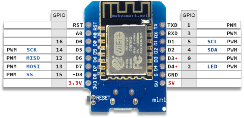

# 8x8 Matrix Display via SPI on D1 Mini


## Order Info

* [TOOGOO(R) Max7119 Matrix-LED-Bausatz fuer Arduino, 8x8, 5,5 V, stufenlos kaskadierbar, 5 Dupond-Kabel](http://www.amazon.de/gp/product/B01535A3EY) (Amazon, 01/2016, 3,20 EUR)
* [Max7119 Matrix-LED-Bausatz für Arduino, 8x8, 5,5 V, stufenlos kaskadierbar, 5 Dupond-Kabel](http://www.amazon.de/gp/product/B00GKEMQUM) (Amazon, 01/2016, 3,57 EUR)

## Spec

* SODIAL Modellnummer: 047763
* SODIAL(R) Max7119 Matrix-LED-Bausatz fuer Arduino
* 8x8 LEDs
* 5,5 V
* stufenlos kaskadierbar
* [Datasheet](https://www.maximintegrated.com/en/products/power/display-power-control/MAX7219.html)

## Power consumption

* All LEDs off: 1.4mA (2.8V)
* All LEDs on: 31.8mA (2.4V)
* Typical use: 4mA (2.8V)

Measured when powered at 3.3V. Expect slightly higher values if powered at 5V.

## D1 Mini SPI pins



| Pin | SPI  | Alias | Description                                            |
|-----|------|-------|--------------------------------------------------------|
| D5  | SCK  | CLK   | Serial Clock                                           |
| D6  | MISO | DOUT  | Master In Slave Out (data from peripherals to D1-Mini) |
| D7  | MOSI | DIN   | Master Out Slave In (data from D1-Mini to peripherals) |
| D8  | SS   | CS    | Slave Select                                           |

All D1-Mini IO pins run at 3.3V.

## Connection to D1 Mini

| Pin Matrix | D1-Mini   | Description                | Code (D1-Mini GPIO index) |
|------------|-----------|----------------------------|---------------------------|
| VCC        | 3V3       | GND                        | -                         |
| GND        | G / GND   | +5V                        | -                         |
| DIN        | D7 / MOSI | Data (Master Out Slave In) | 13                        |
| CS         | D8 / SS   | Slave Select               | 15                        |
| CLK        | D5 / SCK  | Serial Clock               | 14                        |

## Arduino Libraries

At "Platform IO > Libraries > Registry" search for:

* MD_MAX72XX (majicdesigns/MD_MAX72XX@^3.2.3)
* MD_Parola (majicdesigns/MD_Parola@^3.5.4)

```cpp
#include <Arduino.h>
#include <MD_MAX72xx.h>
#include <SPI.h>

#define D1MINI_D5 14
#define D1MINI_D6 12
#define D1MINI_D7 13
#define D1MINI_D8 15

// Matrix on SPI pins
#define HARDWARE_TYPE MD_MAX72XX::GENERIC_HW
#define MAX_DEVICES 1

#define CLK_PIN   D1MINI_D5 // or SCK
#define DATA_PIN  D1MINI_D7 // or MOSI
#define CS_PIN    D1MINI_D8 // or SS

// Usage
MD_MAX72XX mx = MD_MAX72XX(HARDWARE_TYPE, CS_PIN, MAX_DEVICES);

mx.begin();
mx.clear();
mx.control(MD_MAX72XX::INTENSITY, 2);
mx.setPoint(1, 1, true);
```

## Links

* <http://yaab-arduino.blogspot.com/2015/05/beating-heart-with-arduino-and-max7219.html>
