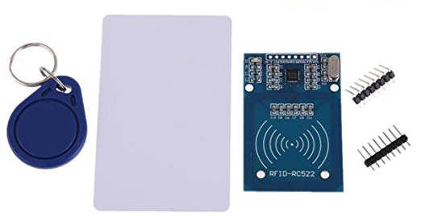

# RFID Reader via SPI / RC522

## Hardware Info



Ordered on 13.02.2018 via Amazon:

* Title: IZOKEE RFID Kit, MFRC RC522 RFID-RC522 RF IC Karte Reader Sensor Modul mit S50 13.56MHz RFID Chipkarte und Key Ring für Mifare Arduino Raspberry Pi, 5 Stück zusätzlich Key Rings als Geschenk (Packung mit 1)
* Price: 6,99 EUR
* Shipping: Prime

## Pin Layout

| Pin RC522 | Description  | Pin WeMo D1 Mini        | Code      |
|-----------|--------------|-------------------------|-----------|
| +3,3V     | VCC          | 3V3                     |           |
| RST       | Reset        | D3 (GPIO 0)             | RST_PIN 0 |
| GND       | Ground       | G                       |           |
| IRQ       | Interrupt    | -                       |           |
| MISO      | SPI MISO     | D6 (GPIO 12 + SPI MISO) |           |
| MOSI      | SPI MOSI     | D7 (GPIO 13 + SPI MOSI) |           |
| SCK       | SPI SCK      | D5 (GPIO 14 + SPI SCK)  |           |
| SDA       | SPI SS / SDA | D8 (GPIO 15 + SPI SS)   | SS_PIN 15 |

SPI pins on the D1 Mini are fixed as listed in the table.
The GPIO values have to be passed to the MFRC522 constructor as listed in code column (do not use the Dx numbers).

```cpp
#define RST_PIN 0
#define SS_PIN 15
MFRC522 mfrc522(SS_PIN, RST_PIN);
```

## Code Samples

* <https://github.com/miguelbalboa/rfid/blob/master/examples/DumpInfo/DumpInfo.ino>
* <https://blog.jeronimus.net/2018/03/rfid-and-wemos-d1-mini-1.html>
* <https://github.com/Jorgen-VikingGod/ESP8266-MFRC522>
