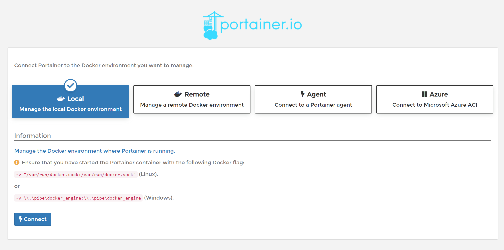

# Docker on Raspberry Pi

## Install Docker

To install Docker on the Raspberry Pi, open a shell (e.g. via `ssh`) and execute the following commands:

* `curl -sSL https://get.docker.com | sh`
* `sudo usermod -aG docker pi`
* `sudo shutdown -r now` (reboot to apply user modification)

Enable docker auto start:

* `sudo systemctl enable docker`
* `sudo systemctl start docker`

Sample output of the docker installation:


```bash
pi@beefy:~ $ curl -sSL https://get.docker.com | sh
# Executing docker install script, commit: 3d8fe77c2c46c5b7571f94b42793905e5b3e42e4
+ sudo -E sh -c apt-get update -qq >/dev/null
+ sudo -E sh -c DEBIAN_FRONTEND=noninteractive apt-get install -y -qq apt-transport-https ca-certificates curl >/dev/null
+ sudo -E sh -c curl -fsSL "https://download.docker.com/linux/raspbian/gpg" | apt-key add -qq - >/dev/null
Warning: apt-key output should not be parsed (stdout is not a terminal)
+ sudo -E sh -c echo "deb [arch=armhf] https://download.docker.com/linux/raspbian buster stable" > /etc/apt/sources.list.d/docker.list
+ sudo -E sh -c apt-get update -qq >/dev/null
+ [ -n  ]
+ sudo -E sh -c apt-get install -y -qq --no-install-recommends docker-ce >/dev/null
+ sudo -E sh -c docker version
Client: Docker Engine - Community
 Version:           20.10.2
 API version:       1.41
 Go version:        go1.13.15
 Git commit:        2291f61
 Built:             Mon Dec 28 16:18:13 2020
 OS/Arch:           linux/arm
 Context:           default
 Experimental:      true

Server: Docker Engine - Community
 Engine:
  Version:          20.10.2
  API version:      1.41 (minimum version 1.12)
  Go version:       go1.13.15
  Git commit:       8891c58
  Built:            Mon Dec 28 16:15:48 2020
  OS/Arch:          linux/arm
  Experimental:     false
 containerd:
  Version:          1.4.3
  GitCommit:        269548fa27e0089a8b8278fc4fc781d7f65a939b
 runc:
  Version:          1.0.0-rc92
  GitCommit:        ff819c7e9184c13b7c2607fe6c30ae19403a7aff
 docker-init:
  Version:          0.19.0
  GitCommit:        de40ad0
If you would like to use Docker as a non-root user, you should now consider
adding your user to the "docker" group with something like:

  sudo usermod -aG docker pi

Remember that you will have to log out and back in for this to take effect!

WARNING: Adding a user to the "docker" group will grant the ability to run
         containers which can be used to obtain root privileges on the
         docker host.
         Refer to https://docs.docker.com/engine/security/security/#docker-daemon-attack-surface
         for more information.
```

## Install Portainer


Portainer is an open source web based docker Administration UI, which itself can be hosted in docker.

So the installation requires this command only. The parameter `--no-auth` disables Portainer authentication. So be sure to make this UI available internally only or remove the parameter.

```bash
docker run -d -p 9000:9000 -v /var/run/docker.sock:/var/run/docker.sock --restart unless-stopped --name Portainer portainer/portainer:alpine --no-auth
```

When the container was started, the administration UI should be available at <http://beefy:9000> (instead of beefy use your Raspberry Pi hostname).

Only at the first login the setup of the local endpoint is possible (at <http://beefy:9000/#/init/endpoint>). On this page **connect to "Local"**.



**Hint:**
If this page is not shown, try to use the InPrivate-Browsing feature of your browser; manually type in the URL or, if all fails, remove all Portainer containers, images and (!) volumes and try again.
Later on, the Portainer UI allows to add endpoints - but it will not be possible to add the local `/var/run/docker.sock` endpoint.
