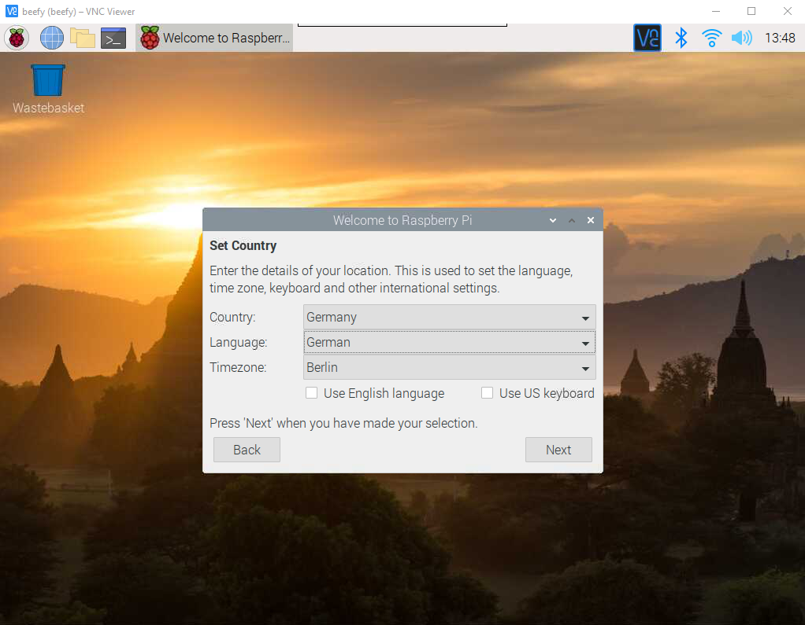

# Raspberry Pi Headless Setup

## Install Image

Use **Raspberry Pi Imager** from <https://www.raspberrypi.org/software> to write a matching image to a micro SD card.

For shell use only:

* Raspberry Pi OS Lite

If graphical desktop shall be used locally or via VNC:

* Raspberry Pi OS with desktop and recommended software
* Raspberry Pi OS with desktop

## Setup SSH and WLAN

An Raspberry Pi SD card contains two drives. The one which is accessible from a windows system is the boot drive.

In the root directory of the boot drive:

* Create an empty file `ssh` to enable ssh functionality
* Create a file `wpa_supplicant.conf` containing the following content to enable connection via WLAN

  ```txt
  country=US
  ctrl_interface=DIR=/var/run/wpa_supplicant GROUP=netdev
  update_config=1

  network={
  ssid="WIFI_SSID"
  scan_ssid=1
  psk="WIFI_PASSWORD"
  key_mgmt=WPA-PSK
  }
  ```

## First start and setup

Boot up the Raspberry and check in the router UI, if it could connect to the WLAN network.

| Setting   | Default Value                |
|-----------|------------------------------|
| Host name | `raspberry` or `raspberrypi` |
| User name | `pi`                         |
| Password  | `raspberry`                  |

Connect via `ssh pi@raspberr`.

Open Raspi Config via `sudo raspi-config` and adapt the following settings:

* **1 System Options**
  * **S3 Password** - Set a new password
  * **S4 Hostname** - Set a new host name
  * **S5 Boot / Auto Login** - Enable desktop with auto login if VNC shall be used
* **2 Display Options**
  * **D1 Resolution** - Set something other than `Default` if VNC shall be used without an attached HDMI device (otherwise later on VNC will display only a message *"Cannot currently show the desktop"*)
* **3 Interface Options**
  * **P3 VNC** - Enable the VNC Server
* **5 Localisation Options** - Set your Language, time zone and keyboard layout
* **6 Advanced Options**
  * **A1 Expand Filesystem** - Use all of the SD card to increase the lifetime of the card

Leave the UI with **Finish** and reboot the device.

### VNC Setup

Now it should be possible to connect via [VNC Viewer](https://www.realvnc.com/de/connect/download/viewer/).


